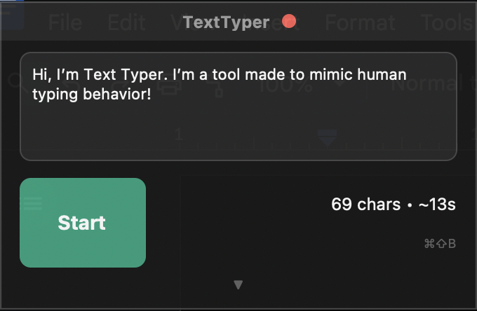
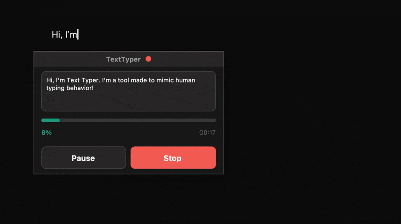
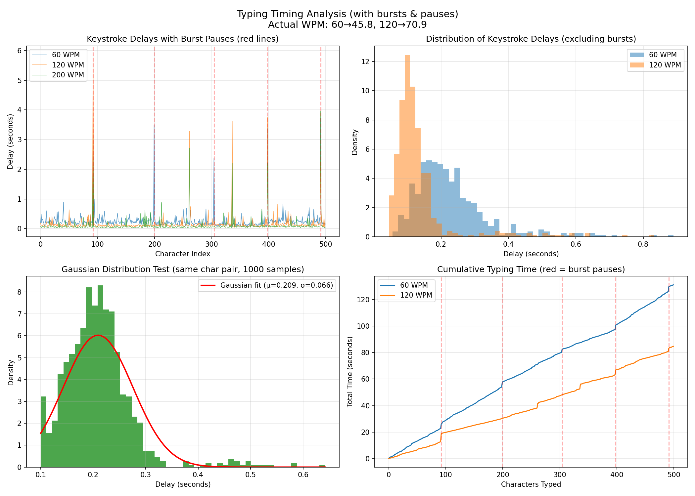

<table align="right" border="0">
  <tr>
    <td width="300px">
      
    </td>
  </tr>
</table>

# TextTyper

Some applications detect paste events. Some forms disable them entirely. And sometimes you just want text to appear character-by-character with human-like rhythm. TextTyper solves this by simulating actual keystrokes with the timing patterns of a real person typing. 



Some applications detect paste events. Some forms disable them entirely. And sometimes you just want text to appear character-by-character with human-like rhythm. TextTyper solves this by simulating actual keystrokes with the timing patterns of a real person typing.

## Mimicing Human-like Typing

Real typing isn't uniform. Humans type in bursts, pause to think, make mistakes, and slow down over time. TextTyper replicates all of this:

| Behavior | Implementation |
| :--- | :--- |
| **Variable Speed** | Gaussian distribution around target WPM (σ=0.066) |
| **Burst Typing** | Fast typing for 2-4 sentences, then a 2-6 second "thinking" pause |
| **Common Patterns** | Frequent letter pairs (th, er, in) are typed faster |
| **Typos & Corrections** | Configurable error rate with realistic adjacent-key mistakes |
| **Fatigue** | Gradual 10% slowdown over long sessions |
| **Micro-hesitations** | Random brief pauses at word boundaries |

### Timing Visualization

The graphs below show actual keystroke timing data from TextTyper:



**Top Left**: Keystroke delays over time. The spikes are "thinking" pauses between sentence bursts.  
**Top Right**: Distribution of delays follows a natural bell curve, not a flat line.  
**Bottom Left**: Gaussian variation (σ=0.066) creates realistic speed fluctuation.  
**Bottom Right**: Cumulative typing time shows clear "stair steps" at burst pauses.

---

## Features

- **Always-on-top overlay** — Stays visible while you work in other apps
- **Markdown support** — Bold, italic, and heading sizes via keyboard shortcuts
- **Global hotkey** — `⌘⇧B` starts typing from anywhere
- **Live preview** — See character count and time estimate before starting
- **Pause/Resume** — Stop mid-sentence and pick up where you left off
- **Configurable** — Adjust WPM (30-400), error rate, pause duration, burst size

---

## Installation

### 1. Clone the Repository

```bash
git clone https://github.com/yourusername/texttyper.git
cd texttyper
```

### 2. Install Dependencies

```bash
pip3 install -r requirements.txt
```

Required packages:
- `customtkinter` — Modern GUI framework
- `pynput` — Keyboard control and hotkey listening
- `pyperclip` — Clipboard access

### 3. Grant Accessibility Permissions

TextTyper needs permission to simulate keystrokes:

1. Open **System Settings** → **Privacy & Security** → **Accessibility**
2. Click the **+** button
3. Add your Terminal app (or Python if running directly)
4. Ensure the checkbox is enabled

### 4. Run

```bash
python3 main.py
```

---

## Usage

1. **Copy text** to your clipboard (or type directly in the app)
2. **Press `⌘⇧B`** or click Start
3. **Click into your target app** during the 3-second countdown
4. **Watch it type** — use Pause/Stop if needed

### Keyboard Shortcut

| Shortcut | Action |
| :--- | :--- |
| `⌘⇧B` (Mac) / `Ctrl+Shift+B` (Win) | Start typing |

### Markdown Formatting

TextTyper converts markdown to Google Docs formatting:

| Markdown | Result |
| :--- | :--- |
| `**bold**` | Triggers `⌘B` before/after |
| `*italic*` | Triggers `⌘I` before/after |
| `# Heading` | Increases font size |
| Line breaks | Presses Enter |

---

## Configuration

Expand the settings panel (▼) to adjust:

| Setting | Range | Description |
| :--- | :--- | :--- |
| **Speed** | 30-400 WPM | Base typing speed |
| **Errors** | 0-10% | Typo frequency (with auto-correction) |
| **Pause** | 1-8s | "Thinking" pause duration between bursts |
| **Burst** | 1-8 sentences | How many sentences before pausing |

---

## Project Structure

```
texttyper/
├── main.py                 # Entry point, hotkey listener
├── config.py               # Settings and constants
├── requirements.txt
├── gui/
│   └── unified_window.py   # Single overlay window
└── engine/
    ├── typer.py            # Keystroke simulation
    ├── timing.py           # Human-like delay calculations
    └── markdown_parser.py  # Markdown to keystrokes
```

---

## License

MIT

